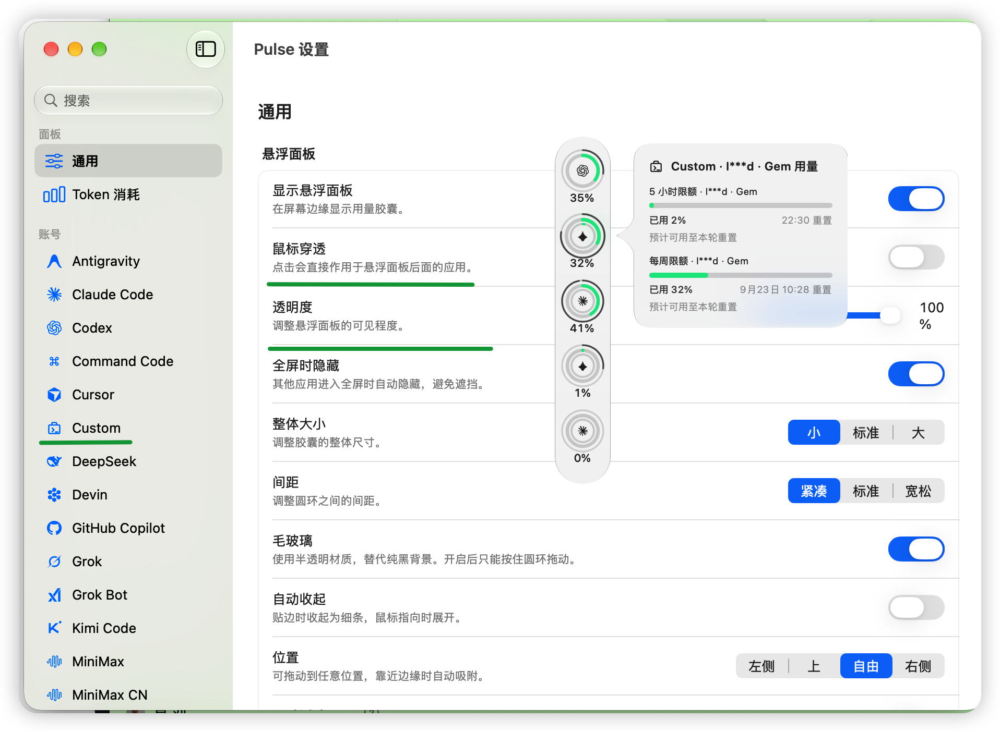

# 自定义脚本供应商 / Custom script providers

Pulse 可以运行你指定的本地脚本，并从脚本的标准输出读取用量。脚本只需要输出一个合法 JSON，不需要把服务商账号、API key 或密码写进 Pulse。



## 配置步骤

1. 打开 **Pulse → Settings → Providers → Add custom script**。
2. 填写显示名称和脚本的绝对路径，例如 `/Users/you/bin/pulse-greendoumi.sh`。
3. 执行 `chmod +x /Users/you/bin/pulse-greendoumi.sh`，确保脚本可执行。
4. 点击测试并保存。Pulse 刷新时启动脚本，只读取 stdout；诊断信息应写到 stderr。

可运行示例见 [`Integrations/custom-provider-samples/`](../Integrations/custom-provider-samples/)。

## 输出格式

```json
{
  "plan": "Pro",
  "windows": [{
    "id": "five-hour",
    "kind": "fiveHour",
    "scope": "default",
    "usedFraction": 0.42,
    "resetsAt": "2026-09-21T16:00:00Z",
    "windowSeconds": 18000,
    "isExhausted": false
  }]
}
```

`usedFraction` 必须是 0 到 1 的已用比例；没有可靠数字时应省略该窗口，不要猜一个百分比。多个供应商时返回顶层 `providers` 数组，完整字段约定见 [`Docs/json-output.md`](json-output.md)。

## 在“绿豆蜜”上试用

如果“绿豆蜜”提供用量或配额接口，可以把示例脚本改成请求它的接口，再把真实返回值映射到 `windows`。建议先用脱敏账号和只读接口试验：先在终端确认 stdout 只有 JSON，再将 token 放在 Keychain、环境变量或已有本地登录文件中；同时对照服务页面/CLI 的数字。Pulse 不会推断额度含义，也不会替你生成 token。

## 常见问题

- 测试失败：先直接运行脚本，检查退出码、stderr 和 JSON。
- 显示旧数据：确认 `resetsAt` 是 ISO 8601 UTC，并保持 Pulse 正在运行。
- 公开仓库安全：真实 token、cookie、账号 ID 和本地路径不要提交。
