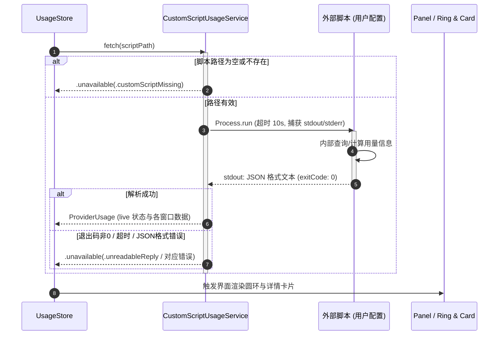

# 设计文档 - v1.4.0-feature 自定义脚本供应商 (Custom Script Provider)

## 背景
Pulse 作为一个原生的 macOS 菜单栏/桌面监控小组件，目前内置了 19 个主流 AI Coding 提供商（如 Claude Code, Codex, Cursor, Kimi, Devin 等）。随着各团队与个人自建网关、私有模型代理、内部平台不断演进，硬编码的供应商无法满足多样的定制监控需求。
通过支持“自定义供应商 (Custom Provider)”，用户只需指定一个可执行脚本路径，脚本在执行后按约定的 JSON 格式向 stdout 输出数据，Pulse 即可无侵入地调度、渲染环形配额与卡片。

## 目标
1. 新增 `Provider.custom` 供应商枚举与对应路由 `UsageRoute.script`。
2. 在 AppSettings 中支持存储自定义脚本路径（`customScriptPath`）。
3. 设计清晰、高扩展性的 JSON 输出规范（包含 windows、usedFraction、resetsAt、plan、creditBalance 等）。
4. 实现 `CustomScriptUsageService`，支持受控异步子进程执行（Process / NSTask）、超时保护（10s）、输出捕获与 JSON 反序列化。
5. 适配 SettingsView 设置面板，允许用户输入/选择脚本路径，并提供即时状态反馈。
6. 在 Panel（UsageRingView / UsageDetailCard）中正确呈现用量圆环、状态图标与多窗口配额详情。
7. 确保多语言同步（en, ja, ko, zh-CN, zh-Hant）并通过脚本检查与单元测试。

## 非目标
- 不由 Pulse 负责管理脚本运行时的复杂依赖环境（如 python 虚拟环境由脚本 shebang 或脚本内部自行负责）。
- 不由 Pulse 推断脚本参数、凭据或内部数据源；脚本路径是唯一配置输入。

## 架构与调用流程



## 约定 JSON 规范定义
脚本执行完毕后，退出码需为 0，并在 `stdout` 输出符合以下结构的 JSON：

```json
{
  "plan": "Team Pro",
  "creditBalance": "$12.50",
  "windows": [
    {
      "id": "5h-window",
      "kind": "fiveHour",
      "scope": "claude-3-7-sonnet",
      "usedFraction": 0.35,
      "resetsAt": "2026-09-20T18:00:00Z",
      "windowSeconds": 18000,
      "isExhausted": false
    },
    {
      "id": "balance",
      "kind": "balance",
      "usedFraction": 0.12,
      "windowSeconds": 0
    }
  ]
}
```

多个独立额度组可使用包装结构。每个 `provider` 会成为一个轨道槽位；其 `windows` 内的 5 小时和周度窗口会作为同一槽位的两层环显示。

`icon` 是 Pulse 内置图标名，例如 `gemini`、`claude`、`openai`。脚本指定的图标优先于设置中为该脚本实例选择的图标；未指定时显示 Custom 默认图标。

```json
{
  "providers": [
    {
      "id": "account-a-gem",
      "displayName": "account-a · Gem",
      "icon": "gemini",
      "windows": [
        { "id": "5h", "kind": "fiveHour", "usedFraction": 0.18 },
        { "id": "weekly", "kind": "weekly", "usedFraction": 0.30 }
      ]
    },
    {
      "id": "account-a-cla",
      "displayName": "account-a · Cla",
      "icon": "claude",
      "windows": [
        { "id": "5h", "kind": "fiveHour", "usedFraction": 0.00 },
        { "id": "weekly", "kind": "weekly", "usedFraction": 0.41 }
      ]
    }
  ]
}
```

## 风险与应对
- **脚本长时间卡住**：设置 10 秒超时中断机制，防止阻塞 Pulse 的主循环。
- **权限与路径展开**：自动展开 `~/` 用户主目录，检查文件可执行权限。
- **数据兜底**：浮点数非法值（如 NaN、负数）在解析时 clamp 到 0...1 或安全回退。
